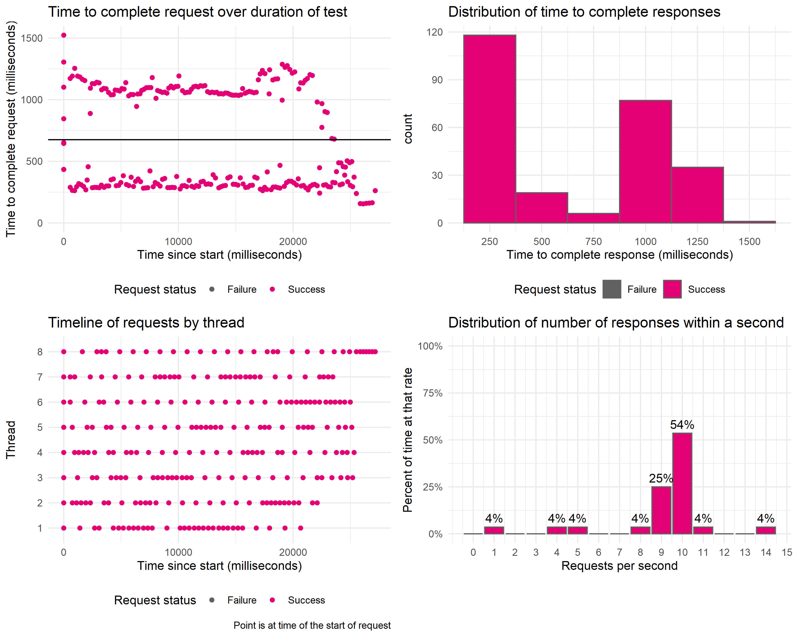

# loadtest - load testing from R 

[](LICENSE)


This package is to make load testing of APIs, such as those created with the R package plumber, easy to do. It uses Apache JMeter on the backend--a modern platform for load testing. The loadtest package is open source and maintained by the AI @ T-Mobile team.

Load testing, the process of ensuring that a website or API works by simulating a massive load a traffic and seeing how the website or API performs, is a critical step in the development of production systems. R is becoming more popular for production system environments through tools such as [plumber](https://www.rplumber.io/), [Rocker](https://hub.docker.com/u/rocker/), and the [T-Mobile R TensorFlow API platform](https://github.com/tmobile/r-tensorflow-api), so having a way to do load testing while staying within the R environment is useful.

This package has a single primary function `loadtest` which is used to run a load test against a URL. For example, suppose we wanted to test having 5 threads hit t-mobile.com, and each thread hits Google 10 times sequentially. To run that test, we do a single `loadtest` call, which creates a data frame of results:

```r
library(loadtest)

results <- loadtest(url = "https://t-mobile.com", method = "GET", threads = 2, loops = 10)

head(results)
```

<div style="width: 100%; overflow: auto;">

| request_id|start time | thread| num threads|response code |response message |request status | sent bytes| received bytes| time since start| elapsed| latency| connect|
|----------:|:----------|------:|-----------:|:-------------|:----------------|:--------------|----------:|--------------:|----------------:|-------:|-------:|-------:|
|          1|12:22:23   |      1|           5|200           |OK               |Success        |        115|          12263|                0|     696|     668|     604|
|          2|12:22:23   |      5|           5|200           |OK               |Success        |        115|          13190|                0|     701|     668|     604|
|          3|12:22:23   |      2|           5|200           |OK               |Success        |        115|          12219|                0|     701|     668|     604|
|          4|12:22:23   |      4|           5|200           |OK               |Success        |        115|          12268|                0|     705|     668|     604|
|          5|12:22:23   |      3|           5|200           |OK               |Success        |        115|          12246|                0|     707|     673|     604|
|          6|12:22:23   |      1|           5|200           |OK               |Success        |        115|          12298|              700|     152|     128|      78|

</div>

This table has 50 rows, one for each of the ten requests that the five threads made. There are lots of useful columns, like:

* __request_status__ - if the request was successful
* __start_time__ - the time the request started
* __elapsed__ - how many milliseconds passed between the start of the request and the end of the response

If you're creating your own API, by using the loadtest package you can test how quickly the responses will be returned as you increase the concurrent requests. This can help you avoid situations where the API is released and is unable to handle the production load.

You can also do more complex requests that have a body or headers:

```r
results <- loadtest(url = "http://deepmoji.teststuff.biz",
                    method = "POST",
                    headers = c("version"="v1.0"),
                    body = list(sentences = list("I love this band")),
                    encode="json",
                    threads = 8,
                    loops = 32,
                    delay_per_request=100)
```

In addition to creating a table of test results, the package has plotting capabilities to help you quickly understand the values of the test. Using the `loadtest::plot_` commands you can plot the data in multiple ways.

```r
plot_elapsed_times(results)
plot_elapsed_times_histogram(results)
plot_requests_by_thread(results)
plot_requests_per_second(results)
```



Starting from the upper-left:

1. The elapsed time of each request of the course of the test. Here we can see that the completion time was rather consistent, but had some variance for the first request of the threads.
2. A histogram of the elapsed times. We can see the vast majority of the requests too around 1750ms to complete.
3. The start time of the requests per each thread. It shows consistent behavior across the threads.
4. The distribution of the number of requests per second. Here we see the API achieved a rate of resolving around 4-5 requests per second. If we expect the production load to be higher than that then there would be a problem.

Finally, you can easily create an Rmarkdown report which includes these plots as well as other summary statistics. This can be useful for automating automatically running load tests as part of a build process. The function takes the results of a load test and a path to save to and generates the report.

```{r}
loadtest_report(results,"[location_to_save_to].html")
```


## Installation

Since loadtest is powered by Apache JMeter, which requires Java, the installation steps are:

1. Install Java*
2. Install JMeter
3. Install loadtest R package

_*While Java is required for loadtest, the package rJava is not needed._

### Installing Java

To install Java, go to the [Oracle website](https://java.com/en/download/help/download_options.xml) and follow their instructions.

You can test you have Java correctly installed by opening a terminal and running `java -version`.

### Installing JMeter

Then, you need to download [Apache JMeter](https://jmeter.apache.org/download_jmeter.cgi), and extract the zip file to a folder.

The `bin` subfolder you extract needs to be added to the system path. You can test you have Apache JMeter correctly installed by opening a terminal and running `jmeter --version`. If you get an error that JMeter doesn't exist, the path was likely not set correctly. 

Alternatively. You can manually specify the path to get to the JMeter bin folder from within R by using:

```r
Sys.setenv("LOADTEST_JMETER_PATH"="[path to jmeter bin folder]")
```

You'll need to do this each time you start R.

### Installing loadtest

You can install the loadtest package by running:

```r
# install.packages("remotes")   # run this if you don't have remotes or devtools installed
remotes::install_github("tmobile/loadtest")
```

### Legal 

_This tool is released as-is, and while we believe it should give you accurate and consistent load testing results, we can't guarantee any level of accuracy. Any issues caused by inaccurate or inconsistent output are not the responsibility of T-Mobile._
